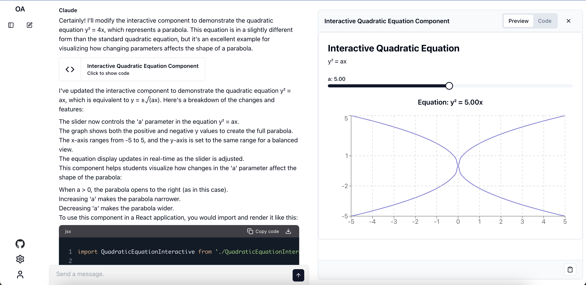

# Open Artifacts



Open Artifacts is a free, open-source project that clones the functionality of [Claude.ai](https://claude.ai) while supporting the generation of Artifacts using the user's Claude API key.

## Features

- Claude.ai-like interface and functionality
- Support for Artifact generation
- Utilizes user's Claude API key for interactions

## Tech Stack

- [Next.js](https://nextjs.org/) - React framework
- [Supabase](https://supabase.io/) - Database and Auth System
- [Claude API](https://www.anthropic.com/) - LLM API
- [shadcn/ui](https://ui.shadcn.com/) - Component Library
- [Vercel AI SDK](https://sdk.vercel.ai/docs/introduction) - Toolkit for building AI-powered applications

## Getting Started

### Installation

1. Clone the repository:

   ```
   git clone https://github.com/13point5/open-artifacts.git
   ```

2. Navigate to the project directory:

   ```
   cd open-artifacts
   ```

3. Install dependencies:

   ```
   npm install
   ```

4. Run the development server:

   ```
   npm run dev
   ```

5. Open [http://localhost:3000](http://localhost:3000) in your browser to see the application.

## License

This project is licensed under the [MIT License](LICENSE).

## Acknowledgments

- Inspired by [prompt2ui](https://github.com/sullyo/prompt2ui) by [sullyo](https://github.com/sullyo), from which code has been used in this project
- Anthropic for the Claude API and for doubling the token limit
- The open-source community for the amazing tools and libraries used in this project
