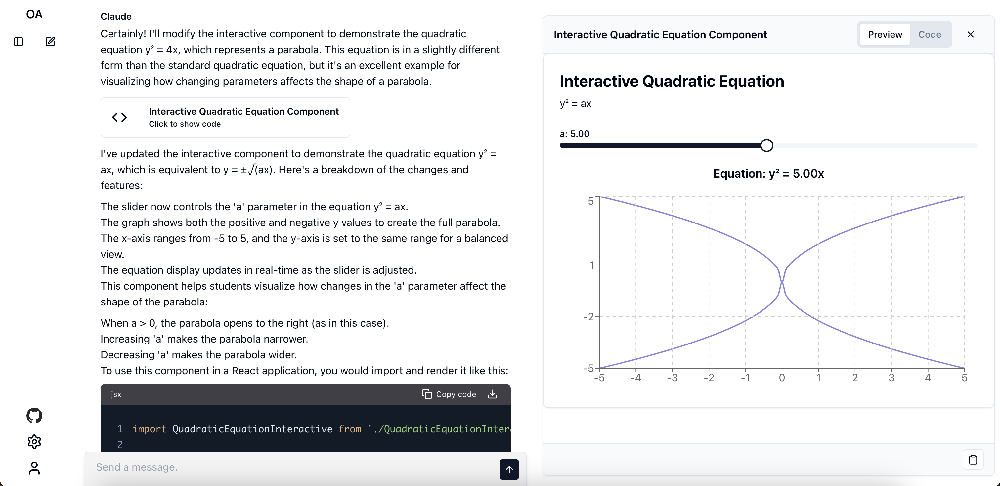
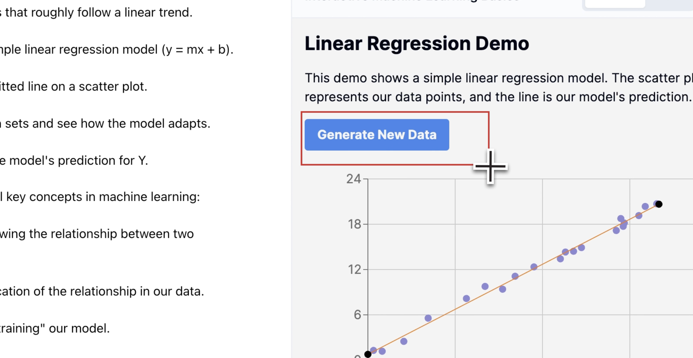

# 🦉 Open Artifacts

  




Open Artifacts is a free, open-source project that clones the functionality of [Claude](https://claude.ai) while supporting the generation of Artifacts with [Anthropic](https://www.anthropic.com/) and [OpenAI](https://openai.com/) LLMs using the user's API keys.

The Artifact viewer is implemented using [Open Artifacts Renderer](https://github.com/13point5/open-artifacts-renderer).

## Features

- 🎨 Generate Artifacts with [Anthropic](https://www.anthropic.com/) and [OpenAI](https://openai.com/) LLMs
- 📸 Crop and 🔊 Talk to iteratively edit Artifacts
- 🎛️ Utilizes user's API keys for interactions

## Tech Stack

- [Next.js](https://nextjs.org/) - React framework
- [Supabase](https://supabase.io/) - Database and Auth System
- [Claude API](https://www.anthropic.com/) - LLM API
- [shadcn/ui](https://ui.shadcn.com/) - Component Library
- [Vercel AI SDK](https://sdk.vercel.ai/docs/introduction) - Toolkit for building AI-powered applications

## Getting Started

1. Clone the repository:

   ```
   git clone https://github.com/13point5/open-artifacts.git
   ```

1. Navigate to the project directory:

   ```
   cd open-artifacts
   ```

### Supabase Setup

1. Install the [Supabase CLI](https://supabase.com/docs/guides/cli/getting-started#installing-the-supabase-cli)

1. Create a Supabase project

1. Initialize Supabase locally

   ```
   supabase init
   ```

1. Link your local project to your remote Supabase project

   ```
   supabase link --project-ref <your-project-ref>
   ```

1. Apply Migrations

   ```
   supabase db push
   ```

1. Copy env variables from your Supabase project

   ```
   NEXT_PUBLIC_SUPABASE_URL=
   NEXT_PUBLIC_SUPABASE_ANON_KEY=
   ```

### App Setup

1. Install dependencies:

   ```
   npm install
   ```

1. Run the development server:

   ```
   npm run dev
   ```

1. Setup [Open Artifacts Renderer](https://github.com/13point5/open-artifacts-renderer) and set the `NEXT_PUBLIC_ARTIFACT_RENDERER_URL` env variable to the URL of the renderer.

   ```
   NEXT_PUBLIC_ARTIFACT_RENDERER_URL=
   ```

1. Open [http://localhost:3000](http://localhost:3000) in your browser to see the application.

## License

This project is licensed under the [MIT License](LICENSE).

## Acknowledgments

- Inspired by [prompt2ui](https://github.com/sullyo/prompt2ui) by [sullyo](https://github.com/sullyo), from which code has been used in this project
- Anthropic for the Claude API and for doubling the token limit
- The open-source community for the amazing tools and libraries used in this project
